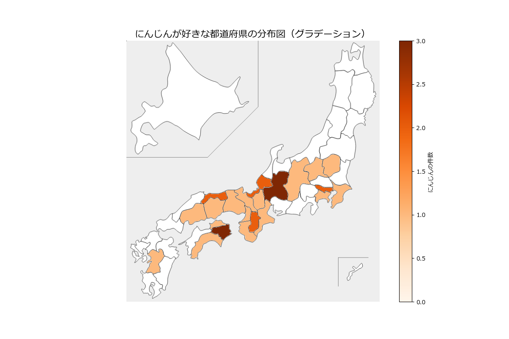

# おでんランキング可視化プロジェクト

このプロジェクトは、ユーザーのおでん具材ランキングデータをもとに、日本地図上で都道府県ごとの人気ランキングを可視化するツールです。特定の具材（例: にんじん）について、都道府県ごとの分布をグラデーションで表示する機能も備えています。

## デモ画像


---

## 目次
1. [プロジェクト概要](#プロジェクト概要)
2. [使用技術](#使用技術)
3. [ファイル構成](#ファイル構成)
4. [インストール](#インストール)
5. [使い方](#使い方)
6. [ライセンス](#ライセンス)

---

## プロジェクト概要
このプロジェクトは、ユーザーの好きなおでんの具材データを都道府県ごとに集計し、ランキングや分布を地図で可視化することを目的としています。特に、以下の機能を提供します：
- ランダムなユーザーデータ生成機能。user_random.py
- おでんのランキングを生成機能。rank_oden_items.py
- 都道府県ごとのランキング1位を地図に表示。top_ranking.py
- 特定の具材（例: にんじん）の分布を色の濃淡（グラデーション）で可視化。nijin.py

---

## 使用技術
- **Python**:
  - pandas
  - matplotlib
  - japanmap
- **データ**: CSVファイル形式でおでん具材ランキングを管理。

---

## ファイル構成
```
├── nijin.png            # にんじんの分布図画像
├── nijin.py             # にんじん分布図作成スクリプト
├── oden_data.csv        # 入力データ: ユーザーの好きなおでん具材データ
├── oden_ranking.csv     # 出力データ: 都道府県ごとのランキングデータ
├── rank_oden_items.py   # おでんランキング集計スクリプト
├── top_ranking.py       # 都道府県ごとのランキング作成スクリプト
├── user_random.py       # ランダムなユーザーデータ生成スクリプト
└── README.md            # このプロジェクトの説明書
```

---

## インストール
1. Pythonをインストールしてください（バージョン3.7以上を推奨）。
2. 必要なライブラリをインストールします：
   ```bash
   pip install pandas matplotlib japanmap
   ```

---

## 使い方

### 1. データの準備
`oden_data.csv`におでん具材データを入力します。データフォーマットは以下の通り：
| ユーザー名 | 出身都道府県 | 好きなおでんの具 |
| ---------- | ------------ | ---------------- |
| user001    | 静岡県       | もち巾着         |

### 2. ランキング集計
都道府県ごとのランキングを計算します：
```bash
python rank_oden_items.py
```

### 3. にんじん分布図の作成
特定の具材（例: にんじん）の分布図を作成します：
```bash
python nijin.py
```

### 4. 出力確認
生成された画像ファイル `nijin.png` を確認してください。

---

## ライセンス
このプロジェクトは自由に使用、修正、再配布可能です（MITライセンス）。

---

## 貢献
このプロジェクトへの貢献は大歓迎です！バグ報告や機能提案があればぜひ教えてください。
